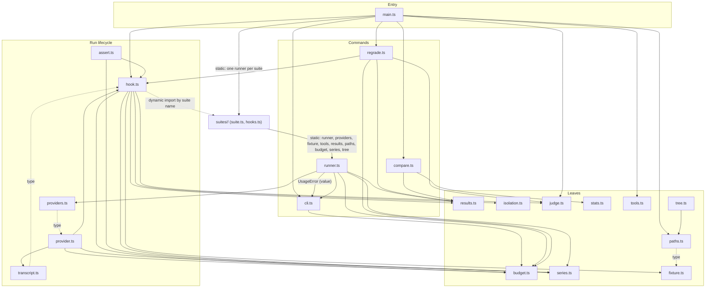

# Architecture

Grounded in `evals/harness/*.ts` (copied to `harness/*.ts`) of `broneq/bdk` branch `v3/T43-regression-eval@825455dd`, whose static imports I read module by module.

## Layers

The import graph has no cycle (BDK-ARCH-1). The edges below are the actual imports of the source; some are type-only (`transcript -> hook` for `ToolCall`, `providers -> provider` for `RunProviderConfig`, `paths -> fixture` for `FixturePin`), so the groups are a reading aid, not a strict layering.

- `budget`, `series`, `results`, `isolation`, `judge`, `fixture`, `stats`, `tools` import nothing from the harness; they hold the ledger, the plan and path shapes, the row format, the isolation check, the judge call, the fixture preparation, the statistics and the pinned tool calls.
- `hook.ts` is the middle of a run: `startRun`, `measureRun`, `recordJudgement` and the `SuiteHooks` interface. The provider and the assertion are two thin entry points promptfoo loads by `file://` path; both read the series plan named by `BENCH_SERIES`, so they share state only through files.
- `main.ts` builds the entry-level dependencies (`claude auth status`, the viewer, `compare`, `regrade`, the judge) and passes them to `cli.ts` through `CliDeps`, which keeps the command parser unit-testable without a model. A suite runner builds its own run-time dependencies (`ensureTools` is dropped, see design; `assertCommitted`, `prepareFixture` with `npmCi`, `evaluate`, `validateConfig`) from the leaf modules, as `regressionRunner` does in the source.

## The suite boundary

`SuiteRunner` and `SuiteHooks` are interfaces owned by the harness; a suite implements them (BDK-ARCH-2). The source names the suites in three places: `SUITES` and `SuiteName` in `cli.ts`, the static imports and the `suites` record in `main.ts`, and the dynamic `loadSuiteHooks` import of `harness/suites/<name>/hooks.ts`, which `regrade` (called from `main.ts` with `hooks: loadSuiteHooks`) and, inside the promptfoo process where no object can be passed from `main.ts`, the provider and the assertion use.

B1 removes the first: `cli.ts` takes the known suite names from `CliDeps.suites` (`Object.keys`) instead of a hard-coded list, so the parser has no suite knowledge. Adding a suite is then a directory `harness/suites/<name>/` plus one entry in the `suites` record of `main.ts`; `loadSuiteHooks` finds `hooks.ts` by name. There is no static cycle: suites import the harness, the harness reaches a suite only through `main.ts` and the dynamic loader.

B1 adds one suite, `smoke`. B3 adds the benchmark suite that implements `measure` with the checklist and `judges` for `regrade`; B7 replaces the inline `plain` workflow with adapters that suites pass to `sessionProvider`. Each needs only its own suite directory and its `main.ts` entry, which is the test of the boundary.

## State and files

All cross-process state is a file, never memory: `.runs/series/<suite>/<series>/plan.json` (read by provider, assertion and hook), `.runs/budget.json` (ledger), `results/<suite>/<series>.jsonl` (rows, the only committed output), `.runs/.../raw/<workflow>/<item>.run-<n>/` (session output, `judge.json`, `measurement.json`), `.runs/.../debug/` (session debug logs). The fixture cache (`prepareFixture` base, one `npm ci`) lives in `.runs/cache/`, which survives every series, as in the source. Working copies and config homes live in the sandbox `${XDG_CACHE_HOME:-~/.cache}/bdk-bench/<checkout>/<suite>/<series>/`, wiped at each series start, outside the repository so a session cannot walk up into this repository's own files; the promptfoo database is `${XDG_CACHE_HOME:-~/.cache}/bdk-bench/promptfoo`, shared by every checkout.

## Isolation

Every run owns its working copy (`runs/<workflow>/<item>.run-<n>/work`), config home and debug log, copied fresh from the workflow's base, so runs go in parallel. The SDK provider's config is fixed when it loads and `beforeEach` does not know the provider, so only the harness provider can give each run its own directories; this is why `provider.ts` wraps the SDK provider (Provider facts, "Per-run working directory").

## Known limit: hidden material

The sandbox keeps a session from walking up into this repository; it does not stop a session with `bypassPermissions` from reading `tasks/*/spec.md` or hidden tests by absolute path. The smoke suite needs neither. The owner of closing this is B3 (it copies hidden tests only after the session ended) together with B4 (the simulated user reads `spec.md`); B1 records it in the design as not decided.
