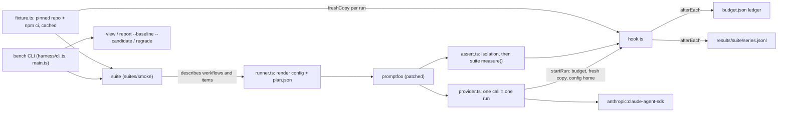

# Design

## Problem

`bdk-bench` has a checklist and two tasks but cannot run a workflow. B1 adds the runner: one Claude Code session per workflow, task and run, in parallel, with cost, turns and wall time recorded and every run visible in the promptfoo viewer. It must not depend on the BDK repository (issue #1, `CLAUDE.md` "Origin").

## Source

The harness to copy is `evals/harness/` of branch `v3/T43-regression-eval` at `825455dd` in `broneq/bdk` (worktree `~/projects/bdk/.claude/worktrees/T15-skill-check`). It is not merged: `staging/v3` still holds the older T40 harness without the budget ledger, `--concurrency`, `view`, `compare` and `regrade`. Plus `evals/package.json`, `pnpm-workspace.yaml`, `patches/promptfoo@0.123.1.patch`, `versions.json` and the Provider facts table of `evals/README.md`. The first commit of the Change records the source commit in its message.

## Approach: copy and slim

Copy the harness and its unit tests, remove what only BDK needs, rename BDK vocabulary, keep one suite as the layer the next issues plug into.



Data flow of a run: the suite fills a `SeriesSetup` (workflows with their provider entries, items, runs). `runner.ts` renders `promptfooconfig.json` and `plan.json` under `.runs/`. promptfoo runs one test per item and run, one column per workflow. The harness provider starts the run (budget check, `freshCopy` of the workflow's base, empty config home, no stale debug log, the suite's `beforeRun`), calls the SDK provider with those paths and adds wall time and a transcript. The harness assertion checks isolation from the debug log, then calls the suite's `measure`. The `afterEach` hook charges the ledger and appends the row, so an aborted series keeps every finished run.

## Layout

```
package.json, pnpm-lock.yaml, pnpm-workspace.yaml   root package; patchedDependencies, allowBuilds
patches/promptfoo@0.123.1.patch                      returns the last result of a session, sums turns
versions.json                                        fixture pin (repository, commit)
harness/*.ts                                         generic runner (below)
harness/suites/<name>/                               suite.ts, hooks.ts, tests; B1 ships `smoke`
results/<suite>/<series>.jsonl                       committed rows
.github/workflows/ci.yml                             install, lint, format, typecheck, unit tests, `pnpm bench check`
```

The root package replaces T43's nested tools package: the rendered configs live in `.runs/` under the root, so `node_modules` of the root resolves the SDK (Provider facts, probe 1). `CLAUDE.md` "Layout" is updated for `harness/suites/` and its "Development commands" lists the new scripts.

## Keep, rename, drop

| Kept (each with its unit tests where the source has them) | Change |
| --- | --- |
| `cli`, `main`, `budget`, `paths`, `results`, `series`, `runner`, `provider`, `providers`, `hook`, `assert`, `isolation`, `judge`, `transcript`, `stats`, `tools`, `tree`, `compare`, `regrade`, `fixture` | rename `bdk*` to `bench*` and cells to workflows (below) |

- Dropped: `plugins.ts` (BDK plugin copies; B7 adds adapters), the suites `regression`, `stages`, `rules-noop`, `review-models`, `with-without`, `execute-ab`, `versions.json` `v2Tag`, every BDK kernel call, `BDK_SETTINGS`, `buildBdkBase`, the BDK-only rows of Provider facts.
- Renamed: `BDK_EVAL_SERIES` to `BENCH_SERIES`; test vars `bdk_item`, `bdk_run` to `bench_item`, `bench_run`; metadata `bdkCell` to `benchWorkflow`; row field `cell` to `workflow`; `provenance.bdkCommit` to `benchCommit` (HEAD of this repository: it versions tasks and checklist); sandbox and promptfoo database under `${XDG_CACHE_HOME:-~/.cache}/bdk-bench/` (the sandbox must stay outside the repository; `sandboxOf` keeps refusing one inside); `assertCommitted` allows changes only under `results/` and `.bdk/` (workflow state of the session that builds the bench itself); probes skip it.
- Turns and wall time: the harness records `turns` and `wall_s` in every row's `metrics` itself (from the SDK result and the provider's `wallMs`), for discarded runs too when the session reported them; a suite's `measure` adds only its own metrics (issue #1). In T43 each suite did this in its own `measure`.
- Row provenance drops the BDK-only `variantHash` and `templateHashes`. It adds: `adapter: { name, version }` (B7 rule "the row records adapter name and version"). For `plain` the version is the pinned `@anthropic-ai/claude-agent-sdk` version, which pins Claude Code (Provider facts: SDK 0.3.284 with Claude Code 2.1.284).
- Fixture: pin read from `versions.json` (`946a2081`), cached, `npm ci` once into the base. The marker file becomes `.bench-base` and the stripped paths stay `.claude`, `.agents`, `CLAUDE.md`, `AGENTS.md`, as `tasks/*/task.yaml` states ("upstream commit minus agent instructions, marker `.bench-base`"). Git identity becomes `Bench` / `bench@bench.invalid`.
- Loader: `loadSuiteHooks` imports `harness/suites/<name>/hooks.ts`; unknown suites are a usage error.

## Suite contract and the `smoke` suite

`SuiteRunner` (`run`, `check`) and `SuiteHooks` (`beforeRun`, `measure`, `passOf`, `judges`) stay as in T43: B3 implements `measure` with the checklist and `judges` for `regrade`; B7 replaces the inline workflow with adapters. B1 does not pre-empt either.

`smoke` has one workflow, `plain` (no plugin, `expectedPlugins: 0`, orchestrator `claude-opus-5-5` in one constant), and one built-in item that is not a benchmark task: the prompt "Create a file HELLO.md that contains the single line hello." in a fresh fixture copy. `measure` reports `completed` (HELLO.md exists) next to cost, turns and wall time from the harness. It needs no `checklist/` or `tasks/` file, so those stay neutral. `bench smoke --probe` is the acceptance run: one row, shown in `bench view`.

## Commands

`pnpm bench smoke [--probe] [--runs N] [--budget USD] [--run-cap USD] [--concurrency N] [--workflows ...] [--items ...]`, `check`, `view`, `report <suite> --baseline <series> --candidate <series>`, `regrade <suite> --series <name>`. `bench check` renders every suite's config for 1 and 5 runs and validates it with the pinned promptfoo: no credentials, no network, no model call. Defaults: budget 100 USD, run cap 15 USD, concurrency 4 (as in T43), and one run per workflow and item (`CLAUDE.md` "Cost"; T43 defaulted to 5 and rejected `--runs 1`, so `--runs` now accepts any integer from 1; the per-suite reports of T43 are not copied; `compare.ts` keeps its `stats.ts` verdict column). `--budget` and `--run-cap` are the only way to move a cap; the ledger is `.runs/budget.json`.

## Tooling and CI

`package.json` scripts: `bench`, `lint` (eslint, `--max-warnings 0`), `format` and `format:check` (prettier), `typecheck` (`tsc --noEmit`), `test` (`vitest run`). Config files are copied from the BDK root and trimmed. `.prettierignore` and the eslint ignores list `.bdk/`, `.runs/` and `tasks/*/hidden`, `tasks/*/reference` (verbatim copies). Other checked-in Markdown and YAML must pass prettier; a failing file is formatted in a commit of its own, never edited for content. After execute, the main thread (not a plan task, workers cannot run kernel commands) updates `.bdk/settings.yaml` with `bdk config set`: a `tsc` typecheck entry and the commands switched from `npx` to the scripts. CI runs on pull requests and `main` with Node from `.nvmrc` and pnpm from `packageManager`: install with `--frozen-lockfile` (fails when the patch does not apply), lint, `format:check`, typecheck, unit tests, `pnpm bench check`.

## Failure paths

- No credentials (`ANTHROPIC_API_KEY` unset and `claude auth status` not logged in): exit 1 before any session.
- Budget reached: the provider refuses to start further runs (`BudgetReached`); runs in progress finish, so a series overshoots by at most `--concurrency - 1` run caps.
- Dirty tree outside `results/` and `.bdk/` (a probe skips the check): a measured series refuses to start, since rows record HEAD.
- Fixture commit mismatch (`FixtureMismatch`) or a missing `.bench-base` stamp: the cached base is rebuilt or the run fails before any session.
- A run whose debug log shows another plugin, enabled claude.ai connectors or an MCP call is discarded with its reason, written as a row, and never counted.
- promptfoo exit 100 means failed assertions (measured, not an error); other codes fail the command and name the raw output file.
- `regrade` verifies every saved judge request before the first judge call, so it never stops halfway; a suite without `judges` exits 2.

## Not decided

- **Hidden material.** A session runs with `bypassPermissions`, so it can read `tasks/*/spec.md` and hidden tests by absolute path; the sandbox only stops walking up. The smoke suite needs neither. Closing this belongs to B3 (hidden tests copied after the session) and B4 (the simulated user reads `spec.md`); recorded as a risk in the ledger.
- **Tool install.** `ensureTools` (auto `pnpm install` of the tools package) is dropped: with a root package, `pnpm install` is the setup step and CI runs it. A `bench` command without `node_modules` fails with the promptfoo error.
- **Per-suite `report <suite>`.** Not copied: the T43 reports are BDK-specific. Only `report <suite> --baseline <series> --candidate <series>` (`compare.ts`) ships; B3 owns the per-task report.
- **Judge model.** `judge.ts` keeps its pinned judge model (`claude-sonnet-5`) with no caller in B1 except `regrade`; B3 decides the final judge protocol (checklist schema: fixed model, three samples).

## Verification of the Change

Unit tests carry over and are extended for the renames and the `adapter` field. `pnpm bench check` is the model-free gate in CI. The one model-backed proof, `bench smoke --probe` and `bench view`, needs credentials and about 0.1-0.5 USD; the user approves its cost before it runs.
